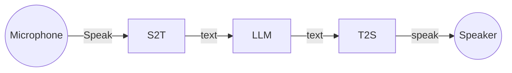

# commpanion-chatbot
The Commpanion ChatBot is an AI chat service developed for the Commpanion system.
## Service architecure

> **Microphone**: Lenovo ThinckReality A3 integrated microphone. 
> **Speaker**: Lenovo ThinckReality A3 integrated speakers. 
> **S2T**: AI model to convert speak to text. 
> **T2S**: AI modem to convert text to speak. 
> **LLM**: Large Language Model for chat. 
