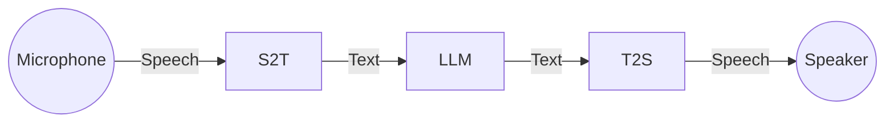

# Commpanion ChatBot

The Commpanion ChatBot is an AI-powered conversational service designed for the Commpanion system, providing seamless voice-to-voice interaction through the Lenovo ThinkReality A3 headset.

## Architecture


### Component Overview

- **Microphone**: Lenovo ThinkReality A3 integrated microphone for audio input
- **Speaker**: Lenovo ThinkReality A3 integrated speakers for audio output
- **S2T (Speech-to-Text)**: AI model converting spoken language to text
- **T2S (Text-to-Speech)**: AI model converting text responses to speech
- **LLM (Large Language Model)**: Core conversational AI for generating responses

## Table of Contents

- [Architecture](#architecture)
- [Features](#features)
- [Prerequisites](#prerequisites)
- [Installation](#installation)
- [Usage](#usage)
- [Configuration](#configuration)
- [Contributing](#contributing)
- [License](#license)

## Features

- **Voice-to-Voice Interaction**: Complete speech-to-text and text-to-speech pipeline
- **AI-Powered Conversations**: Integrated with Large Language Models for intelligent responses
- **AR Glasses Integration**: Optimized for Lenovo ThinkReality A3 hardware
- **Real-time and Local Processing**: Low-latency audio processing for natural conversations without network needed

## Prerequisites

Before installing the Commpanion ChatBot, ensure you have the following:

### Hardware Requirements
- Lenovo ThinkReality A3 AR headset
- Snapdragon X Plus 

### Software Requirements
- Python 3.10.x
- LM Studio

### System Requirements
- Operating System: Windows 10/11, macOS, or Linux
- RAM: Minimum 8GB (16GB recommended for optimal performance)
- Storage: At least 5GB free space for models and dependencies

## Installation

Follow these steps to set up the Commpanion ChatBot:

### 1. Clone the Repository
```bash
git clone https://github.com/julienbltt/commpanion-chatbot.git
cd commpanion-chatbot
```

### 2. Create Virtual Environment
```bash
python -m venv .venv
```

### 3. Activate Virtual Environment

**Windows:**
```bash
.venv\Scripts\activate
```

**macOS/Linux:**
```bash
source .venv/bin/activate
```

### 4. Install Dependencies
```bash
pip install -r requirements.txt
```

### 5. Set Up LM Studio
1. Download and install [LM Studio](https://lmstudio.ai/)
2. Download a compatible LLM model through LM Studio
3. Start the LM Studio server

### 6. Hardware Setup
1. Connect your Lenovo ThinkReality A3 headset
2. Ensure audio input/output devices are properly configured
3. Test microphone and speaker functionality

## Usage

### Starting the Application
```bash
python main.py
```

### Basic Operation
1. Put on your Lenovo ThinkReality A3 glasses
2. Launch the application
3. Begin speaking saying "Alexa"- the system will automatically detect your voice
4. Listen for the AI response through the glasses speakers
5. Continue the conversation naturally

### Stopping the Application
- Press `Ctrl+C` in the terminal

## Configuration

### LM Studio Configuration
- Ensure LM Studio is running and serving a model
- Default connection settings can be modified in the configuration files
- Supported model formats: GGUF, GGML

### Audio Settings
- Microphone sensitivity and speaker volume can be adjusted
- Audio device selection may be configured for different hardware setups

## Troubleshooting

### Common Issues

**Issue: Python version compatibility**
- Solution: Ensure you're using Python 3.10.x exactly as specified (3.11.x should also work)

**Issue: LM Studio connection failed**
- Solution: Verify LM Studio is running and the model is loaded

**Issue: Audio device not detected**
- Solution: Check ThinkReality A3 drivers and system audio settings

**Issue: Poor speech recognition**
- Solution: Ensure clear audio input and check microphone positioning

## Contributing

We welcome contributions to the Commpanion ChatBot project!

### Development Setup
1. Fork the repository
2. Create a feature branch (`git checkout -b feature/amazing-feature`)
3. Make your changes
4. Commit your changes (`git commit -m 'Add amazing feature'`)
5. Push to the branch (`git push origin feature/amazing-feature`)
6. Open a Pull Request

### Code Standards
- Follow PEP 8 Python style guidelines
- Include docstrings for all functions and classes
- Add unit tests for new features
- Update documentation as needed

## License

This project is licensed under the [MIT License](LICENSE) - see the LICENSE file for details.

## Support

For support and questions:
- Create an issue on [GitHub Issues](https://github.com/julienbltt/commpanion-chatbot/issues)
- Check the documentation for troubleshooting guides

## Acknowledgments

- Open source community for various AI models and libraries

---

**Repository**: [https://github.com/julienbltt/commpanion-chatbot](https://github.com/julienbltt/commpanion-chatbot)